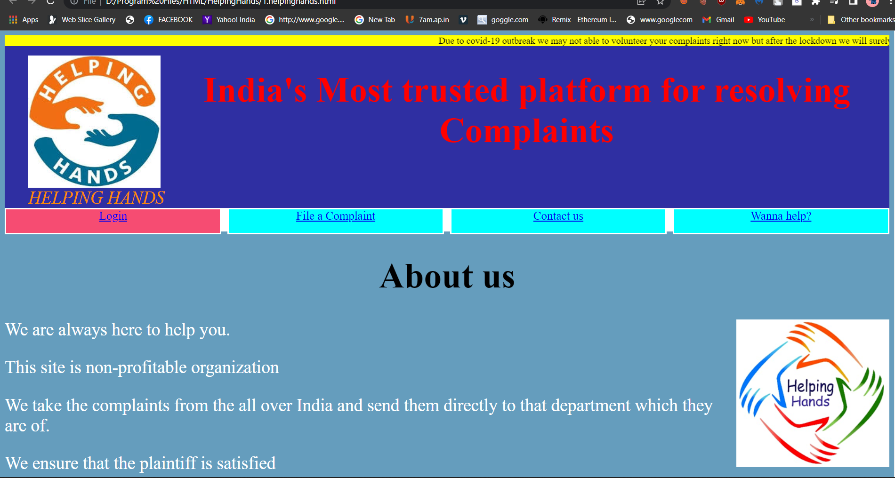

# HelpingHands
Public Grievance and Monitoring for Govt. Service  

https://hasakii42.github.io/HelpingHands/1.helpinghands.html

# HTML Website Template


## Features

Your new HTML website will immediately have publishable and documented code, and all these features:

 - Deploy using `rake` (and you don't need to be a nerd to use it)
 - Clean folder structure
 - Testing as a standard
 - Turnkey access to Travis CI
 - HTTPS by default
 - Documentation for contributors

## How to use this

First clone or [download a release](https://hasakii42.github.io/HelpingHands/1.helpinghands.html), that is the starting point for your site.

THIS LIST IS EASY, CHECK IT OFF ONE-BY-ONE BABY!

 - [ ] Open `index.html` in your favorite text editor and make a great web page, add other content if necessary.
 - [ ] Fix all validation testing errors (see **Build instructions**, below)
 - [ ] Upload your website source code to GitHub or other collaboration point
 - [ ] Enable Travis CI validation testing for your repository
 - [ ] Replace all details below, inspire people to contribute to your project.
 - [ ] Update the release script in `Rakefile` with details to publish to your server.
 - [ ] Delete all this crap up here.
 - [ ] Publish the site (full steps are under **Deploy** below in case you forget)
 - [ ] Set up HTTPS on your website, some [hints are here](https://github.com/fulldecent/html-website-template/wiki/How-to-set-up-HTTPS)

THEN YOU'RE DONE, GO STAR [html-website-template](https://github.com/fulldecent/html-website-template) FOR UPDATES.

---


## Mission

This Website helps people to file there complaints regrading Govt. Services 

## Build instructions

We test and publish this website using a few simple tools. Please set up these tools (takes about 3 minutes) to contribute seriously to our project:

1. Set up Ruby on your system
   * For macOS, open Terminal.app and paste in these commands
     * [Install Homebrew](https://brew.sh/) (click the link and paste that one command into Terminal.app)
     * `brew install ruby`
   * For Linux Mint, open Terminal and paste in these commands
     * `sudo apt-get install ruby-dev build-essential libxml2 libxslt-dev libcurl4-openssl-dev`
2. `gem update --system`
2. `gem install bundler`
3. `export NOKOGIRI_USE_SYSTEM_LIBRARIES=true`
3. `bundle install`

Now you are done setting up. Use this command to build the website.

```sh
bundle exec rake build
```

You can now access the website by pointing your browser to the `BUILD` folder or running a command like `cd BUILD; php -S localhost:8000`.

Also, you can check for common problems on our website automatically, just run this command.

```sh
bundle exec rake test
```

## Deploy instructions

Use this command to publish the website online to our server.

```sh
bundle exec rake publish
```

You can only run that command if you have authorized SSH keys on your computer.

## Author

Hasakii and [other contributors](https://github.com/fulldecent/html-website-template/graphs/contributors) made this website with love.

## License

Copyright 2021 Hasakii. All rights reserved.
